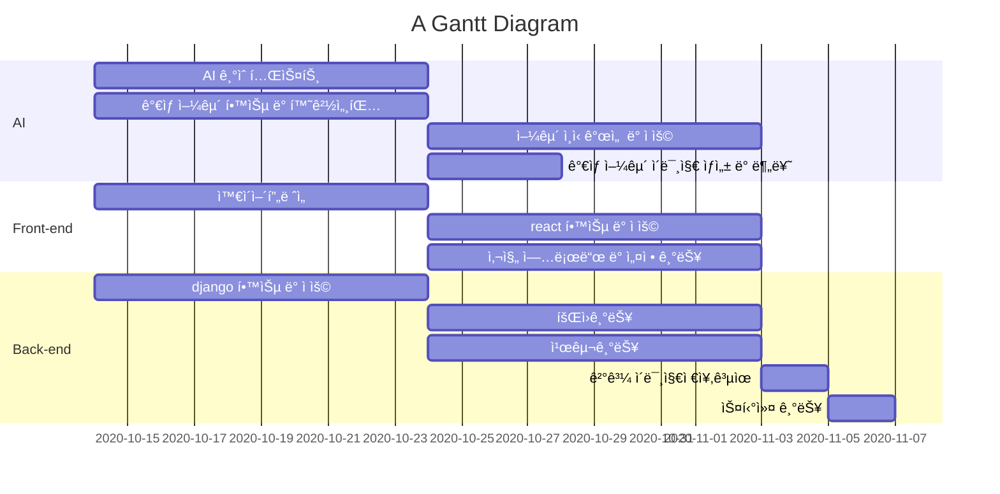

# project_eggs
## 📖 Gantt :fire:

```mermaid
gantt
    title A Gantt Diagram
    dateFormat  YYYY-MM-DD
    section AI
    AI 기술테스트  : a1, 2020-10-14, 10d
    ê°€ìƒ ì–¼êµ´ 학습 ë° í™˜ê²½ì„¸íŒ…  : 2020-10-14, 10d
    얼굴 ì¸ì‹ 개선 ë° ì ìš© : after a1, 10d
    ê°€ìƒ ì–¼êµ´ ì´ë¯¸ì§€ ìƒì„± ë° ë¶„ë¥˜ : after a1, 4d

    section Front-end
    와ì´ì–´í”„ë ˆì„     :a1,2020-10-14  , 10d
    react 학습 ë° ì ìš© : after a1,  10d
    사진 업로드 ë° ì„¤ì • 기능 :after a1 , 10d

    section Back-end
    django 학습 ë° ì ìš© : a1,2020-10-14 , 10d
    회ì›ê¸°ëŠ¥      :a2,after a1 , 10d
    친구기능      :after a1  ,10d
    ê²°ê³¼ ì´ë¯¸ì§€ì €ì¥,공유  : a3,after a2, 2d
    스티커 기능  : a4,after a3, 2d
```